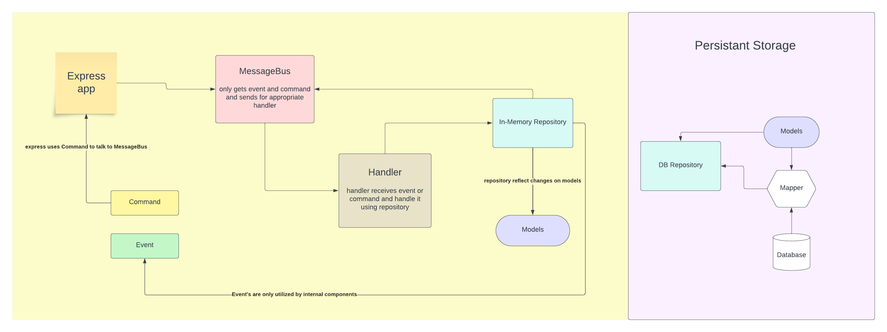

# fullstack developer coding assigment.

This is my solution regarding to this assignment. just a few things to notice: <br>

- since you metioned to `Focus on showing craftsmanship and code quality over full functionality`, and also since I'm more strong at `backend`, and because of the lack of time, I decided to focus on only the backend side of it, but you can checkout this [project](https://github.com/salmanbarani/ticketing/tree/main/client) to see how I used `React.Js`.
- I come from Python world and I'm not too strong at JS and its frameworks, but I decided to give me best.<br>

# TeamBoard project

The Teamboard is a production-ready company-wide steps leaderboard application for teams of employees, created using JS, Typescript, Node.js Using Event-Driven Architecture.

## Environments

This project has three environments: `development`, `staging` and `production` (`master` branch). The `development` environment is where code changes and new features are tested before deployment to production. The `stanging` environment is where the final tests are applied before shipping to the production, and The `production` environment is where the finalized, tested code is deployed for use by end-users.

### Development

In this environemnt you can run this project on your local computer. in order to do that, please follow below steps:<br>

1. First of all you need to make sure that `docker` and `docker-compose` are installed, than Starting from root directory type `git checkout development` and then `cd backend/`.

2. the only thing you need to do is typing `make build` and then `make up`.
3. you can access the api documents looking up `http://localhost:3000/api-docs/`.

4. in order to apply tests first `make down` if the project is already running and then `make test`.

#### Api Examples.

To create a new counter:<br>
POST: `URL: localhost:3000/api/counters`<br>

```
{
    "counterName": "Amer"
}
```

<br>

To get all counters:<br>
GET: `URL: localhost:3000/api/counters` <br>

To get specific counter:<br>
GET: `URL: localhost:3000/api/counters/Amer`. Amer is counter name<br>

To delete counter:<br>
DELETE: `URL: localhost:3000/api/counters/Amer`. <br>

To create a new team:<br>
POST: `URL: localhost:3000/api/teams`<br>

```
{
    "teamName": "Apple"
}
```

<br>

To get all teams:<br>
GET: `URL: localhost:3000/api/teams` <br>

<br>
To get specific team: <br>

GET: `URL: http://localhost:3000/api/teams/Apple`. Apple is counter name <br>
<br>

To delete team:<br>
DELETE: `URL: localhost:3000/api/teams/Apple`.

<br>

To add a counter a team: <br>
POST: `URL: localhost:3000/api/teams/Apple/add`.<br>

```
{
    "counterName": "Amer"
}
```

To add steps:<br>

- Note: Counter needs to be added to a team before taking steps, otherwise previous steps of the counter are not reflected to total teams steps

POST: `URL: localhost:3000/api/counters/Amer/add-steps`. Amer is counter name<br>

```
empty body
```

### Production

In this environemnt you can deploy your code into production. Actually I wanted to apply `CI/CD` pipeline to be triggered on `master` branch pushes, I mostly use `Cloud Build` for triggers and `cloud run` to deploy. but I didn't have the access to the repository. so a few changes need to be made before any deployment<br>

## Architecture

This project was created using domain & event driven archetecture and can easily be detached from this project, and attached to any JS project using `npm registry`.<br>
here's a short description of this project:<br>

1. This project was created using domain driven approach. models and tests are easy to read by any business person, so they can understand what's going on in the code.

2. the whole project consists of seperate layers (`express application`, `service layer`, `domain layer`). these layers are decoupled and can be used apart from each other and each layer can only talk( has dependency ) with lower layers, the only dependency is on Abstraaction. for exmaple:

- Express.js main responsibily is processing requests, and it's seperate from the main logic, so for any write operation it only talks with messagebus using `Commands`. and knows nothing about the other layers.
- `services layer` is our main logic and knows nothing about the infrastructure. it only depend on abstraction.

3. `models` has no dependency with `database`, actually `database` can have dependency on `models`.this has a huge benefit if we decided to change DB.

4. since we've decoupled our components using seperate layers, it's so easy to scale the project.

5. Our main `models` are completely hidden from the client so it can only talk with `Teamboard` model which works as an Aggregate, it's main benefit is we can easily maintain the internal consistency, both conceptually and persistent storage. and it's the best place to store relevent `Events` (only repository can talks with `Teamboard` model)

6. You can learn much by looking at the below flow:



All compnents depend on only abstraction.

## Additional questions

### Persistence

1.How would you add a persistent storage layer such that the app could be restarted without losing counter states?

- The only thing we need is a mapper to map data to models, and also we need to create a repository that talks with the DB; this class needs to extend `ITeamBoardRepository` interface. then we can attach it to our application in `/src/teamboard/config.ts` file by importing this repository, and using it in `messagbus`.

  2.What storage technology would you suggest?

- Since it's a simple application, we can choose any databases. but since we might have a huge interaction and frequent updates a database system that can handle high concurrency, scalability, and fast read/write operations would be ideal. I prefer to choose `Postgresql`.
  <br>

### Fault tolerance

1.How would you design the app in order to make the functionality be available even if some parts of the underlying hardware systems were to fail?

- There are differnt soluctions to do that. a few options might be:
  - `Redundancy and Load Balancing`: Deploying the app across multiple servers or instances to ensure redundancy.
  - `Distributed Data Storage`: Using distributed databases or storage systems to avoid a single point of failure for data storage. and replicating data across multiple nodes to ensure data availability even if some nodes fail.
  - `Microservices Architecture`:
  - and much more

### Scalability

1.How would you design the app in order to ensure that it wouldn’t slow down or fail if usage increased by many orders of magnitude? what if this turned into a global contest with 10x, 100x, 1000x the number of teams and traffic?

- It requires careful planning and the use of scalable architectural patterns. Here are some strategies to ensure your app can handle such growth:
  _ Since we might have lots of traffic going to one instance of the application it's important to deploy the app across multiple servers or instances. and configure a loadbalancer to route traffic equally through instances.
  _ Microservices Architecture: Adopting a microservices architecture, where different functionalities are divided into separate, loosely coupled services. aach service can be scaled independently based on its demand.
  _ Caching Mechanisms, Since for our application we don't store too much, I think we can get benefit from using `in-memory caching` DBs.
  _ Much more.

  2.Does your choice of persistence layer change in this scenario?

- Definitely Yes, I try to choose a database that can be easily scalled horizantly. and as I mentioed we can get benefit from using `caching` DBs for our data.

### Authentication

1.How would you ensure that only authorised users can submit and/or retrieve data?

- By creating an authentication middleware that can be called before routing traffic to each `routes`, there we can apply any authentication or authorization.

  2.How would you then add support to allow different users to only update specific counters? Or perform only specific operations?

- I think it would be great idea to create a scallable permission system, a simple example:
  - Each User can join one or more Groups
  - Define some Roles, like (Admin, Team admins, Team member)
  - give Permission to each Role,
  - bind Roles to Grous
  - add Users to each Group
  - for each operation we can define Permission which that operation need the User have, then authorize based on these permission.

## Final Notes

1. If we decided to use a persistant storage, It would be great to create `unit-of-work` class that, works as an entrypoint to db and enable handlers to talk to it instead of `repository`. so we can have a better consistency, and easily apply transactional and ACID operations.

2. for this project, `Event`s are not stored; if we decided to choose a persistant storage it would be great idea to also store `Events` so if something failed, we can re-trigger them.

3. Read and Write logic are seperate from each other. It might not be necessry to do that for such a simple application, but i designed the application this way so we can resolve some future requirements like:

   - the client application might decide to use `redis` for caching all read operations.

   - the client application might decide to have a complex views based on its requirements, and it's not necessary to change the whole `teamboard` application for such thing.

4. I think it would great to make `teamboard` an npm packge and store it in `npm registry` so any npm user can install it.
